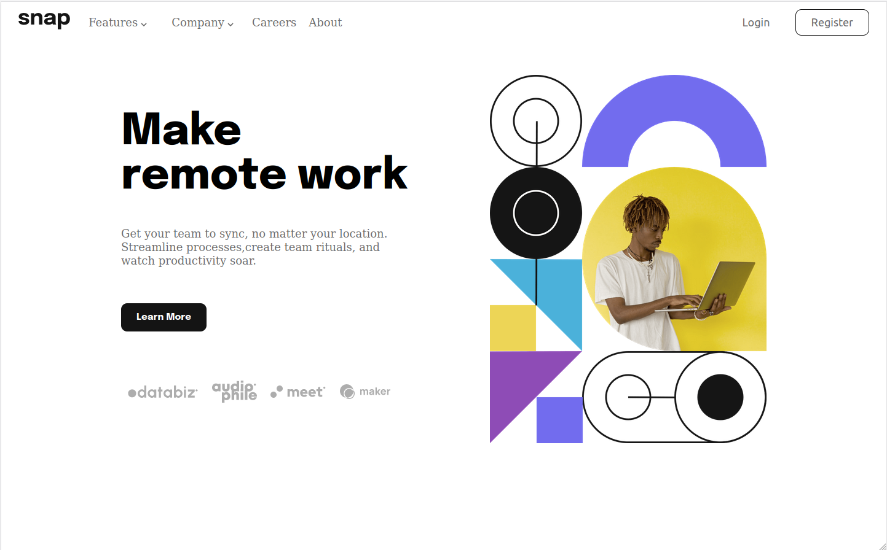
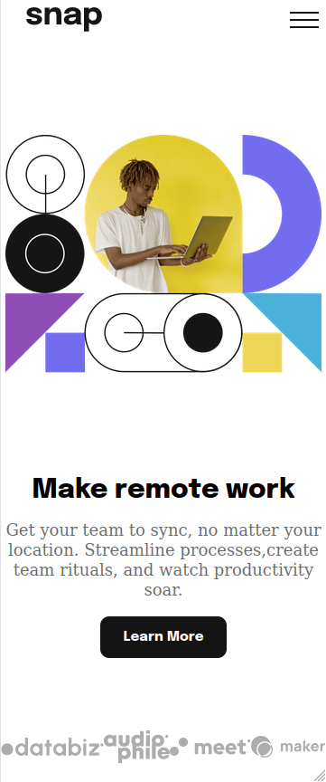

# Frontend Mentor - Intro section with dropdown navigation solution

This is a solution to the [Intro section with dropdown navigation challenge on Frontend Mentor](https://www.frontendmentor.io/challenges/intro-section-with-dropdown-navigation-ryaPetHE5). Frontend Mentor challenges help you improve your coding skills by building realistic projects. 

## Table of contents

- [Overview](#overview)
  - [The challenge](#the-challenge)
  - [Screenshot](#screenshot)
  - [Links](#links)
- [My process](#my-process)
  - [Built with](#built-with)
  - [What I learned](#what-i-learned)
  - [Continued development](#continued-development)
  - [Useful resources](#useful-resources)
- [Author](#author)

## Overview

### The challenge

The objective of this challenge was to make a one page site with different dropdown and responsiveness for mobile phone.

### Screenshot

### Links

- Solution URL: [Add solution URL here](https://github.com/UrbanskiDev/FrontendMentor-Advice-Generator-App)
- Live Site URL: [Add live site URL here](https://your-live-site-url.com)

## My process
I began by creating an HTML page that was both desktop and mobile friendly.
Then I worked on CSS for the desktop before moving on to responsive for mobile phones.
I concluded the project by writing some Javascript for the mobile hamburger. 

### Built with

- Semantic HTML5 markup
- CSS custom properties
- Flexbox
- CSS Grid
- Desktop-first workflow

### What I learned

I studied how to utilize CSS Grid and practiced CSS Flexbox. It also gave me the opportunity to work on responsive design.
### Continued development

I was able to improve the design, which was not fully comparable to the supplied design.
I could also try to create a full-stack application using the FrontEnd Mentor challenges. 

### Useful resources

- [CSS Grid](https://css-tricks.com/snippets/css/complete-guide-grid/) - This helped me to apprehend CSS Grid.

## Author

- Website - [Anthony](https://www.your-site.com) Website not existing for now
- Frontend Mentor - [@UrbanskiDev](https://www.frontendmentor.io/profile/UrbanskiDev)
